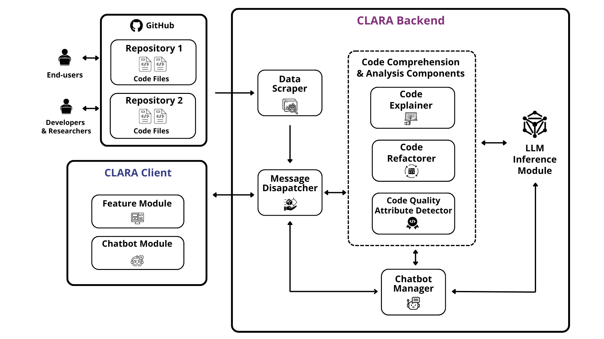

  

<h1 align="center">CLARA (Code expLAiner & Repo Analyzer)</h1>

## What is CLARA?

CLARA is an open-source Chrome Extension that acts as a browser extension that utilizes state-of-the-art inference model to assist developers and
researchers. CLARA has 3 features:
1. Comprehending code files and code fragments 
2. Code refactoring
3. Code quality attribute detection

---

## Install CLARA:

CLARA can be installed as a Chrome Extension on any Chrome repository. The installation link of CLARA is given below, using which a user can install CLARA on any Chromium-based Browser.

:link: [Install CLARA](https://chromewebstore.google.com/detail/clara/elidmleeoibempdgheabdhjdocppbioh)

## About this Repository

This repository hosts the code, resources, and supporting materials for the *CLARA Extension*. It is organized into the following folders:

### Replication Package
This folder contains all materials necessary to replicate the experiments, evaluations, and studies conducted for CLARA. It is further divided into the following subfolders:
- *Model_Evaluation*: Includes code to replicate the model evaluation result, and the author's evaluation for the LLMs for the 3 tasks of CLARA.
- *User_Study*: Contains the user study questionnaire and survey results related to CLARA.

### CLARA Tool
This folder contains the core codebase for the CLARA tool. The accompanying README.md file provides detailed instructions on how to run and customize CLARA to suit your requirements.

### assets
This folder holds images and other utility files used throughout the repository, including visuals for documentation purposes.

Feel free to explore these folders for a comprehensive understanding of CLARA and its functionality.

---

## CLARA in Action:

  

CLARA can be easily installed in any Chromium-based browser(Chrome, Brave, Edge) via its Chrome Web Store page  by clicking ‘Add to Browser’. Once installed, visiting any
GitHub code file triggers CLARA’s pop-up at the top-right( 1 in Figure).In CLARA’s popup, there are four buttons. The ”Explain Full Code File” button can give a context-aware explanation of the code file. The ”Explain Marked/Selected Code” button can help the user to understand a specific highlighted part.The ”Refactor the Code” button provides a refactored version of the source code with descriptive comments. The ’See Code Quality Attributes’ button displays quality metrics of the code file. After clicking on any of these 4 buttons, CLARA’s generated response ( 2 in Figure) is displayed in a module. A user can also leverage an AI-assisted chatbot ( 3 in figure) while using each of CLARA’s features and ask followup questions or inquiries in a continuous conversation.
---

## CLARA's Architecture:

CLARA is implemented using Python with the following architecture:  

  

CLARA’s architecture, shown in, is composed of two subsystem units: (1) Backend, and (2) Client.

***A. Backend of CLARA***

CLARA’s backend consists of four main components:

***1) Data Scraper:*** After CLARA is installed in a browser, when a user visits the code files of an open-source GitHub repository, this component scrapes necessary code file information along with repository metadata essential for contextual understanding (e.g., repo title, file tree containing paths of all files and folders, readme information, tags and topics) and communicates with message dispatcher for data propagation.

***2) Message Dispatcher:*** This component acts as a middleware between CLARA’s client and backend. This component dispatches client-side request to the relevant code comprehension/analysis component or to the chatbot manager. Likewise, the generated feedback response is sent back to the client’s appropriate module from the backend through this component.

***3) Code Comprehension & Analysis Components:*** There are three components in CLARA that assist users with code comprehension and analysis tasks :

***i) Code Explainer:*** This component retrieves the necessary code file data, repository’s contextual information and the required action event from the message dispatcher. Then, it constructs a well-defined prompt by parsing the retrieved code and repository context data and sends it to the LLM inference module. After receiving the response, the component processes the output, formats it appropriately, and returns it using message dispatcher.

***ii) Code Refactorer:*** When a user requests code refactoring, this component receives the action request and the code file data from message dispatcher, constructs an appropriate prompt with instructions to generate a clean, refactored version of the code with descriptive comments about refactoring changes, passes it to the LLM inference module. Then, it returns the formatted response to the client via message dispatcher.

***iii) Code Quality Attribute Detector:*** This component analyzes the code file data and predicts quality attributes, such as cyclomatic complexity, maintainability index, and CVE classified vulnerabilities. Upon receiving the action request from the message dispatcher, this component breaks the code, formats it properly, and constructs a suitable prompt to for the inference module. Then, it utilizes the message dispatcher to return the formatted output.

***4) Chatbot Manager:*** The chatbot manager facilitates communication between the client’s chatbot module and backend’s LLM inference module. In doing so, it manages conversational history, parses relevant information (both from scraped data and user inquiries), and constructs well-formatted and structured prompts and response messages accordingly.

***B. CLARA’s Client Side (Frontend)***

CLARA’s client design structure contains a pop-up with four buttons, representing its features. Additionally, CLARA’s feedback response section is divided into two key modules: (1) Feature Module, and (2) Chatbot Module. The feature module shows the generated feedback response in a structured and user-friendly format. The Chatbot Module contains an input field for receiving user inquiries and an output area where both user questions and chatbot responses are displayed in a clear, conversational format.

--- 

## How can I contribute to CLARA?

We are more than happy to receive your contributions (any kind of contributions). If you have an idea of a feature or enhancement, or if you find a bug, please open an issue (or a pull request). If you have questions, feel free to contact us: <a href="https://github.com/adnan23062000">Ahmed Adnan</a> (bsse1131@iit.du.ac.bd),   <a href="https://github.com/antu-saha">Saad Sakib Noor</a> (bsse1122@iit.du.ac.bd), <a href="https://github.com/mushfiqurgalib">Mushfiqur Rahman</a> (mushfiqur.rahman@bubt.edu.bd), and <a href="">Kazi Sakib</a> (sakib@iit.du.ac.bd)

---
  

   Decide how the results from the new feature will be presented. For example:
   - Add comments to GitHub issues.
   - Attach labels based on the feature's output.

---
